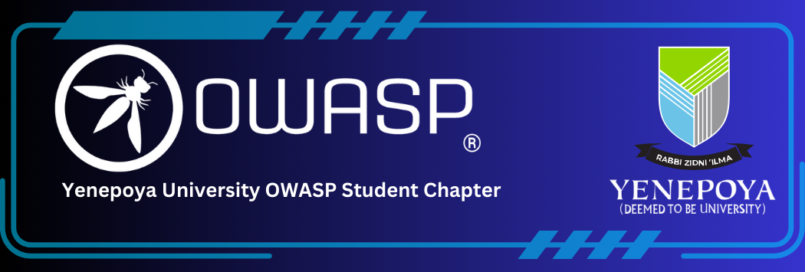

---

layout: col-sidebar
title: OWASP Yenepoya Institute
tags: OWASP Yenepoya
region: Asia
country: India
meetup-group:

---

## Welcome to the OWASP Yenepoya Institute Chapter
---
<!-- -->

---
**Yenepoya University**, located in Mangalore, is a prominent educational institution known for its excellence in education, research, and innovation. It has been a steady source of highly skilled talent, contributing not only to the nation but also to overseas endeavors. Renowned for its pioneering efforts in engineering education, research, and innovation, Yenepoya University stands at the forefront of academic excellence.

## Vision

Our vision is to cultivate a culture of cyber vigilance and excellence, empowering individuals to safeguard digital assets and mitigate cybersecurity threats effectively.

## Mission

- Promoting awareness and understanding of web application security among students and professionals.
- Equipping members with the knowledge, skills, and resources necessary to effectively address cybersecurity challenges.
- Fostering collaboration and knowledge sharing within the cybersecurity community.
  
- The university proudly hosts the **OWASP Student Chapter,** a distinguished coding society comprising talented individuals committed to solving complex problems using innovative techniques and discoveries. Through a series of meticulously organized hackathons, tech-talks, workshops, and coding nights, the university cultivates a vibrant coding culture across its campus. These initiatives underscore the university's unwavering dedication to nurturing creative intellects and creating an environment conducive to technological advancement and societal progress.

## University Collaboration with IBM ICE

The **OWASP Yenepoya Student Chapter** is honored to be in collaboration with IBM through the esteemed **IBM ICE Program**, reflecting our steadfast dedication to nurturing innovation and excellence in the realm of technology. This unique partnership extends its benefits to students enrolled at **Balmatta Campus**, providing them with unparalleled access to a wealth of resources, comprehensive training modules, and immersive hands-on learning experiences. Through active participation in the IBM ICE Program, students from Balmatta Campus are not only equipped to make substantial contributions to the cybersecurity landscape but are also empowered to transcend boundaries and leave a lasting impact across various domains. This collaboration underscores the enduring commitment of Yenepoya University and IBM ICE to pioneering advancements and setting new standards of excellence in technology.

## Participation
The Open Worldwide Application Security Project (OWASP) is a nonprofit foundation that works to improve the security of software. All of our projects, tools, documents, forums, and chapters are free and open to anyone interested in improving application security. 

Chapters are led by local leaders in accordance with the [Chapters Policy](/www-policy/operational/chapters). Financial contributions should only be made online using the authorized online donation button. 

Everyone is welcome and encouraged to participate in our [Projects](/projects/), [Local Chapters](/chapters/), [Events](/events/), [Online Groups](https://groups.google.com/a/owasp.com/){:target='_blank'}, and [Community Slack Channel](https://owasp.slack.com/){:target='_blank'}. We especially encourage diversity in all our initiatives. OWASP is a fantastic place to learn about application security, to network, and even to build your reputation as an expert. We also encourage you to be [become a member](/membership/) or consider a [donation](/donate/) to support our ongoing work.

Next Meeting/Event <!-- You should keep this section as it will populate your meetup events -->
---------------------
### Our Upcoming Event! 🌟
**🌐 2: Embracing the Future: Exploring 5G Technology and Cybersecurity 🛡️**
- Stay tuned for more details on date and time. Don't miss this opportunity to dive into the world of 5G technology and cybersecurity! 🚀 

We Have Lots Of Exciting Stuff Coming Up Very Soon ! Stay Tuned on 
-  <a href="https://www.linkedin.com/company/owasp-yenepoya/" target="_blank" >    Linkedin </a>  
-  <a href="https://t.me/owasp_yenepoya" target="_blank" >   Telegram</a>  

