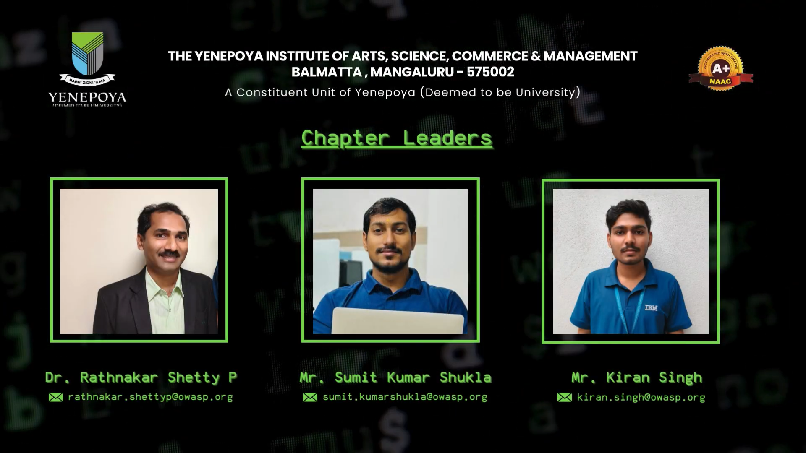

### Yenepoya Institute Information
* 
* [Yenepoya (Deemed to be University)](https://www.yiascm.yenepoya.edu.in/) brings you a world-class educational experience in the pristine surroundings of a tranquil south Indian town. Come explore Yenepoya and evolve into a technology-enabled future.

### Social Links
* <a href="https://www.linkedin.com/company/owasp-yenepoya/" target="_blank" >    Linkedin </a>  

* <a href="https://t.me/owasp_yenepoya" target="_blank" >   Telegram</a>  
<!--* [Meetup](#)
-->
<!--*
### Our Upcoming Event! 🌟
<iframe src="https://docs.google.com/forms/d/e/1FAIpQLSdzqfFuDgylj9Lq_hiCvwXmNZDFJUMRGuuC3-rwV2h9kXPHKw/viewform?embedded=true" width="440" height="753" frameborder="0" marginheight="0" marginwidth="0">Loading…</iframe>
-->

