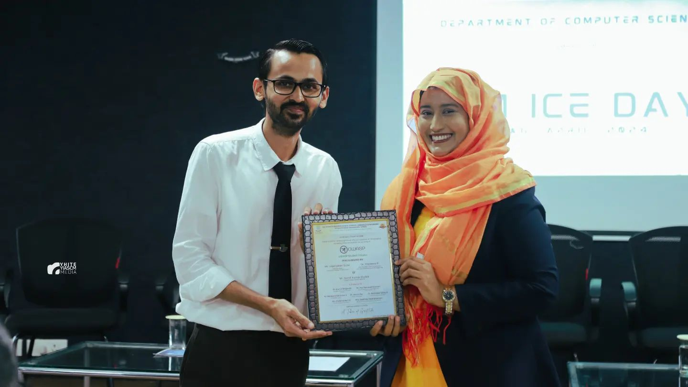

### Conducted Events 

## 1. Chapter Inaugration (5th April , 2024) 

Total Attendees: 195
Time : 10: 00 AM - 11:00 AM
Venue : Auditorium, 4th Floor, YIASCM

The chapter was inaugrated in the presence of **Mr. Viqaruddin Surki** (Delivery Head for IBM ICE), **Dr. Shareena P** (Vice Principal - YIASCM) & **Mr. Sumit Kumar Shukla** (Subject Matter Expert, IBM ICE) and various office bearers of Yenepoya Institute. [A short video from our inaugration
](https://www.linkedin.com/posts/owasp-yenepoya_highlights-owasp-yenepoya-institute-chapter-activity-7183010322050347008-5GFb?utm_source=share&utm_medium=member_desktop).

  
  
  
  
  

